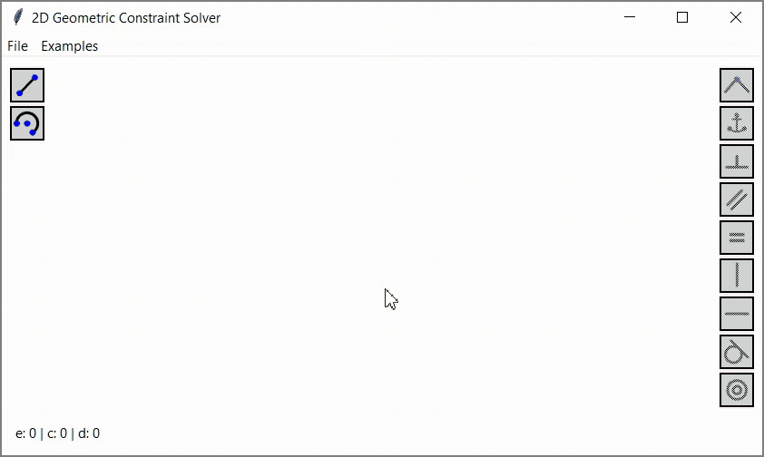

# 2D Geometric Constraint Solver



This project is an attempt to utilize [mathematical optimization algorithms](https://en.wikipedia.org/wiki/Mathematical_optimization), specifically [SLSQP](https://docs.scipy.org/doc/scipy/reference/optimize.minimize-slsqp.html), to deal with [geometric constraint solving](https://en.wikipedia.org/wiki/Geometric_constraint_solving) problem.

Currently, the project is not stable and mature enough to be considered seriously, but you can still experiment with it.

Here you can find more information on how it works: https://vmnnk.com/en/2023-10-18/2d-geometric-constraint-solver

## How to run

```
pip install -r requirements.txt
python src/main.py
```

## How to use

1. Move around the canvas by holding down the mouse wheel button and dragging
1. Use the buttons on the left to add a new segment or an arc. You can also use hotkeys ('s' for segment, 'a' for arc)
1. Left click the point/segment/arc to select it. Click on an empty space to clear the selection
1. The available constraints are automatically displayed for the selected items. Left click the constraint button on the right to apply the constraint
1. To delete a segment or an arc, select it and press DELETE
1. To remove a constraint, left click its icon and press DELETE
1. Press 'i' to print some debug information