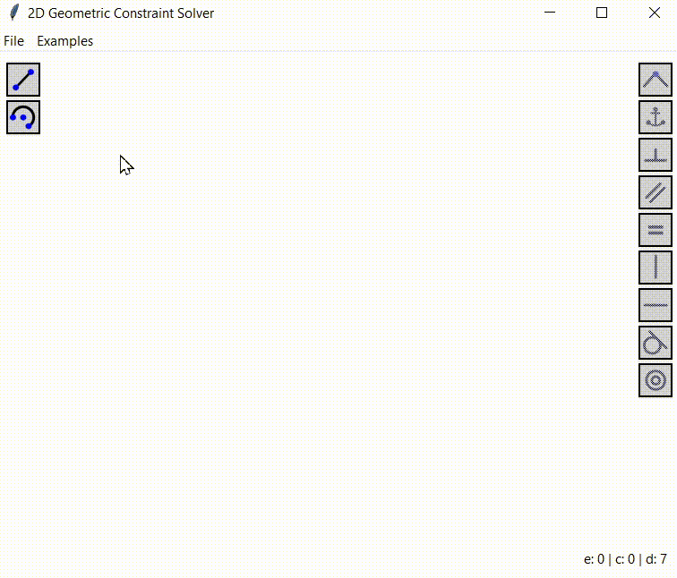

# 2D Geometric Constraint Solver



This project is an attempt to utilize [mathematical optimization algorithms](https://en.wikipedia.org/wiki/Mathematical_optimization), specifically [SLSQP](https://docs.scipy.org/doc/scipy/reference/optimize.minimize-slsqp.html), to deal with [geometric constraint solving](https://en.wikipedia.org/wiki/Geometric_constraint_solving) problem.

Currently, the project is not stable and mature enough to be considered seriously, but you can still experiment with it.

## How to run

```
pip install -r requirements.txt
python src/main.py
```