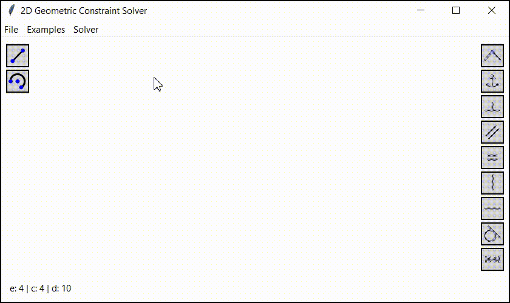

# 2D Geometric Constraint Solver



Update (January 2026):

1. Added support for the advanced [IPOPT solver](https://en.wikipedia.org/wiki/IPOPT) via [CasADi](https://web.casadi.org/). The solver type can now be selected at runtime via the menu.
1. Added the ability to zoom the canvas using the mouse wheel scroll.
1. Added more keyboard shortcuts and tooltips displaying them for all buttons.
1. Added dimensions for segments and arcs.

This project is an attempt to utilize [mathematical optimization algorithms](https://en.wikipedia.org/wiki/Mathematical_optimization), specifically [SLSQP](https://docs.scipy.org/doc/scipy/reference/optimize.minimize-slsqp.html), to deal with [geometric constraint solving](https://en.wikipedia.org/wiki/Geometric_constraint_solving) problem.

Currently, the project is not stable and mature enough to be considered seriously, but you can still experiment with it.

Here you can find more information on how it works: https://vmnnk.com/en/2023-10-18/2d-geometric-constraint-solver

## How to run

```
pip install -r requirements.txt
python src/main.py
```

## How to use

1. Pan the canvas by holding down the mouse wheel button and dragging. Zoom the canvas using the mouse wheel scroll.
1. Use the buttons on the left to add a new segment or an arc. You can also use hotkeys ('s' for segment, 'a' for arc).
1. Left-click a point, segment, or arc to select it. Click on an empty space to clear the selection.
1. Available constraints are automatically displayed for selected items. Left-click the constraint button on the right to apply it. Hover over any button to see its keyboard shortcut.
1. To delete a segment or an arc, select it and press DELETE.
1. To remove a constraint, left-click its icon and press DELETE.
1. Press 'p' to print debug information.